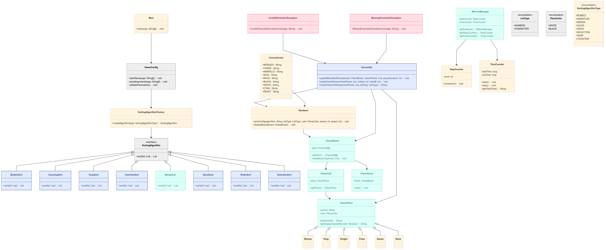
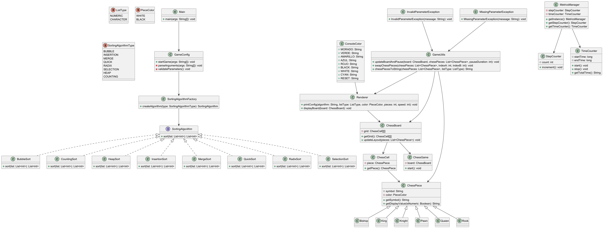
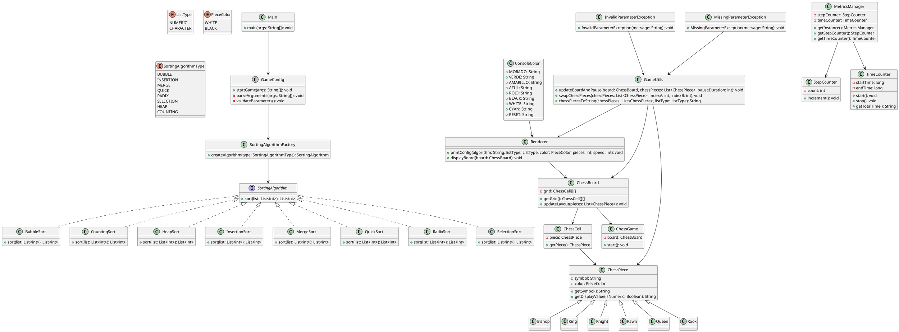
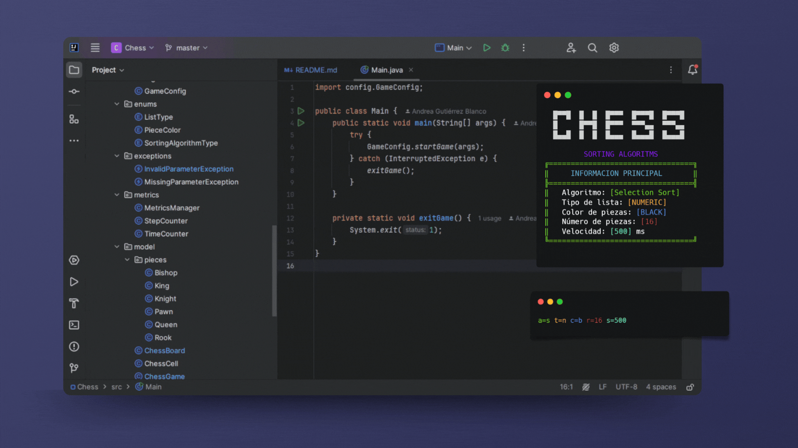
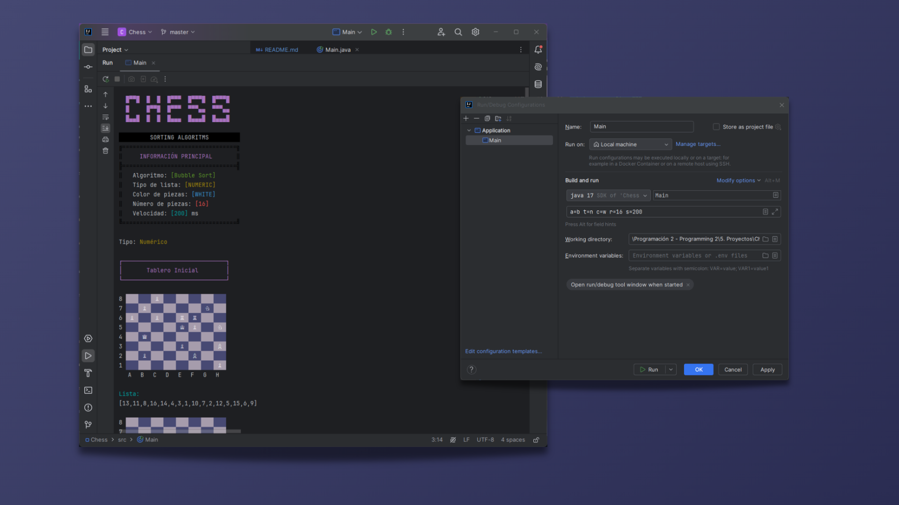
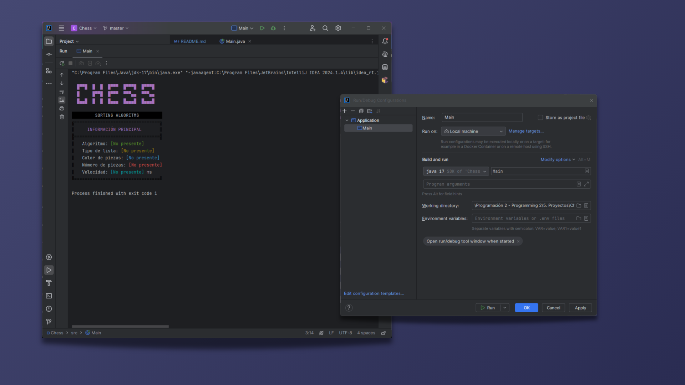
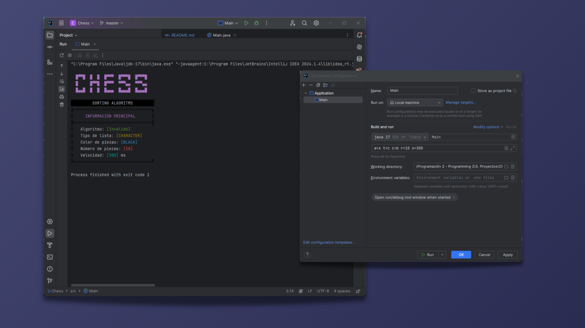

# Chess : Sorting Algorithms

[](#)
[](#)


[](#)

# Algoritmos de Ordenamiento para Ajedrez

## Descripción del proyecto

Este proyecto es una simulación interactiva que combina el mundo del ajedrez con diversos algoritmos de ordenamiento. La
idea es visualizar el proceso de ordenamiento aplicándolo a un conjunto de piezas de ajedrez, utilizando algoritmos
clásicos como Bubble Sort, Quick Sort, Insertion Sort, entre otros. La aplicación cuenta con una interfaz en consola que
muestra el tablero de ajedrez y actualiza en tiempo real el proceso de ordenamiento, permitiendo apreciar la ejecución
paso a paso, junto con métricas como el tiempo transcurrido y el número total de pasos.

## Características

- **Visualización interactiva:** Renderiza el tablero de ajedrez y muestra el proceso de ordenamiento en tiempo real.
- **Múltiples algoritmos de ordenamiento:** Incluye Bubble Sort, Counting Sort, Heap Sort, Insertion Sort, Merge Sort,
  Quick Sort, Radix Sort y Selection Sort.
- **Configuración vía línea de comandos:** Permite ajustar parámetros como el algoritmo a utilizar, el tipo de lista (
  numérica o por caracteres), el color de las piezas, el número de piezas y la velocidad de ejecución (en milisegundos).
- **Métricas de rendimiento:** Registra el tiempo de ejecución y el número de pasos realizados durante el proceso de
  ordenamiento.
- **Arquitectura modular:** Separación clara de responsabilidades en paquetes
  como `algorithms`, `model`, `enums`, `utils`, `config`, entre otros.

## Requisitos

- **Java 17:** Se requiere Java 17 o superior para compilar y ejecutar el proyecto.

## Instalación

1. Clona el repositorio en tu máquina local:

```bash
git clone https://github.com/GutBla/PROJECT_Chess_Sorting_Algorithms.git
```

2. Ingresa al directorio del proyecto

```bash
cd PROJECT_Chess_Sorting_Algorithms
```

## Uso

El proyecto se ejecuta a través de la clase `Main.java`. Los parámetros se ingresan mediante argumentos de línea de
comandos, usando las siguientes claves:

- `a`: Código del algoritmo de ordenamiento (por ejemplo, `b` para Bubble Sort, `q` para Quick Sort, etc.).
- `t`: Tipo de lista (por ejemplo, `n` para numérico o `c` para caracter).
- `c`: Color de las piezas (por ejemplo, `w` para blancas, `b` para negras).
- `r`: Número de piezas (valores permitidos: 1, 2, 4, 6, 8, 10, 16).
- `s`: Velocidad en milisegundos (valor entre 100 y 1000).

Ejemplo de ejecución:

```bash
java Main a=b t=n c=w r=16 s=200
```

Este comando ejecuta el proyecto utilizando Bubble Sort, lista numérica, piezas blancas, 16 piezas y una velocidad de
200 ms.
## ¿Qué es el Ajedrez?

El ajedrez es un juego de estrategia de mesa que se juega entre dos personas. Se desarrolla en un tablero de 8x8 casillas y cada jugador cuenta con un conjunto de 16 piezas, cada una con movimientos y funciones específicas. El objetivo principal del juego es capturar al rey del oponente mediante una serie de movimientos estratégicos.


## Historia del Ajedrez

El ajedrez tiene una historia milenaria que se remonta a la India en el siglo VI, donde se jugaba una versión primitiva llamada "Chaturanga". Este juego se extendió a Persia, donde se le llamó "Shatranj" y posteriormente llegó a Europa a través de los árabes. En el siglo XV, el ajedrez moderno tomó forma en España e Italia, con las reglas y movimientos que conocemos hoy en día.


## Piezas del Ajedrez

El juego consta de las siguientes piezas:

| Pieza | Icono | Abreviaciones | Movimiento |
| --- | --- | --- | --- |
| Rey | ♔ / ♚ | KB / KN | Se mueve una casilla en cualquier dirección |
| Reina | ♕ / ♛ | QB / QN | Se mueve en todas las direcciones sin límite de casillas |
| Torre | ♖ / ♜ | TB / TN | Se mueve en líneas rectas |
| Alfil | ♗ / ♝ | AB / AN | Se mueve en diagonales |
| Caballo | ♘ / ♞ | CB / CN | Se mueve en "L" |
| Peón | ♙ / ♟ | PB / PN | Se mueve una casilla hacia adelante, captura en diagonal |


---

## Tablero de Ajedrez

El tablero de ajedrez es una cuadrícula de 8x8 casillas alternadas entre colores claros y oscuros. Cada casilla está identificada por coordenadas alfanuméricas (ejemplo: "e4").

```bash
  +----+----+----+----+----+----+----+----+
8 | TN | CN | AN | QN | KN | AN | CN | TN |
  +----+----+----+----+----+----+----+----+
7 | PN | PN | PN | PN | PN | PN | PN | PN |
  +----+----+----+----+----+----+----+----+
6 |    |    |    |    |    |    |    |    |
  +----+----+----+----+----+----+----+----+
5 |    |    |    |    |    |    |    |    |
  +----+----+----+----+----+----+----+----+
4 |    |    |    |    |    |    |    |    |
  +----+----+----+----+----+----+----+----+
3 |    |    |    |    |    |    |    |    |
  +----+----+----+----+----+----+----+----+
2 | PN | PN | PN | PN | PN | PN | PN | PN |
  +----+----+----+----+----+----+----+----+
1 | TN | CN | AN | QN | KN | AN | CN | TN |
  +----+----+----+----+----+----+----+----+
    A    B    C    D    E    F    G    H

```

```bash
  +----+----+----+----+----+----+----+----+
8 | ♜ | ♞ | ♝ | ♛ | ♚ | ♝ | ♞ | ♜ |
  +----+----+----+----+----+----+----+----+
7 | ♟ | ♟ | ♟ | ♟ | ♟ | ♟ | ♟ | ♟ |
  +----+----+----+----+----+----+----+----+
6 |    |    |    |    |    |    |    |    |
  +----+----+----+----+----+----+----+----+
5 |    |    |    |    |    |    |    |    |
  +----+----+----+----+----+----+----+----+
4 |    |    |    |    |    |    |    |    |
  +----+----+----+----+----+----+----+----+
3 |    |    |    |    |    |    |    |    |
  +----+----+----+----+----+----+----+----+
2 | ♙ | ♙ | ♙ | ♙ | ♙ | ♙ | ♙ | ♙ |
  +----+----+----+----+----+----+----+----+
1 | ♖ | ♘ | ♗ | ♕ | ♔ | ♗ | ♘ | ♖ |
  +----+----+----+----+----+----+----+----+
    A    B    C    D    E    F    G    H

```


## Algoritmos de Ordenamiento (a)

Los algoritmos de ordenamiento son procedimientos diseñados para organizar un conjunto de elementos en un orden determinado, ya sea ascendente o descendente. Estos algoritmos tienen aplicaciones en informática, bases de datos y en este caso, en la organización de las piezas de ajedrez en un tablero.

> [!WARNING]
> Algoritmos de Ordenamiento (a):
> 
> - **Valores Válidos:** s, b , i, m, q, h, c, r.
> - **Validación:** Si no es uno de los valores validos, se considera **inválido**.


### Selection Sort (Selección) `a=s` o `a=S`

Este algoritmo selecciona el elemento más pequeño y lo intercambia con el primer elemento, repitiendo este proceso con el resto de la lista.


### Bubble Sort (Burbuja) `a=b` o `a=B`

Compara elementos adyacentes y los intercambia si están en el orden incorrecto, recorriendo la lista varias veces.


### Insertion Sort (Inserción) `a=i` o `a=I`

Inserta cada elemento en su posición correcta dentro de una parte ordenada de la lista.


### Merge Sort (Combinación) `a=m` o `a=M`

Divide la lista en partes más pequeñas, las ordena y luego las combina en una lista ordenada.


### Quick Sort (Rápida) `a=q` o `a=Q`

Selecciona un pivote, divide la lista en elementos menores y mayores que el pivote y ordena cada sublista recursivamente.


### Heap Sort (Montón) `a=h` o `a=H`

Construye un montón binario y extrae el elemento más grande repetidamente para formar la lista ordenada.


### Counting Sort (Conteo) `a=c` o `a=C`

Cuenta la frecuencia de cada elemento y usa esa información para construir la lista ordenada.


### Radix Sort (Raíz) `a=r` o `a=R`

Ordena los números considerando sus dígitos de menor a mayor peso.


## Tipos de Listas (t)

En el proyecto se pueden representar las piezas del ajedrez usando dos tipos de listas:

> [!WARNING]
> Tipos de Listas (t):
> 
> - **Valores Válidos:** n , c
> - **Validación:** Si no es uno de los valores validos, se considera **inválido**

### Lista de Números `t=n` o `t=N`

```
1. Rey
2. Reina
3. Torre I
4. Torre II
5. Alfil I
6. Alfil II
7. Caballo I
8. Caballo II
9. Peón 1
10. Peón 2
11. Peón 3
12. Peón 4
13. Peón 5
14. Peón 6
15. Peón 7
16. Peón 8
```

### Lista de Caracteres `t=c` o `t=C`

```
a. Rey
b. Reina
c. Torre I
d. Torre II
e. Alfil I
f. Alfil II
g. Caballo I
h. Caballo II
i. Peón 1
j. Peón 2
k. Peón 3
l. Peón 4
m. Peón 5
n. Peón 6
o. Peón 7
p. Peón 8
```

## ¿Qué significa el Color de Piezas (c)?

Las piezas pueden tener dos colores:

> [!WARNING]
> Color de Piezas (c):
> 
> - **Valores Válidos:** b , w
> - **Validación:** Si no es uno de los valores validos, se considera **inválido**

### Piezas Negras

Representan el jugador de las piezas oscuras.  `c=b` o `c=B`

### Piezas Blancas

Representan el jugador de las piezas claras. `c=w` o `c+W`

## ¿Qué es la Cantidad de Piezas (r)?

Determina cuántas piezas se colocan en el tablero:

> [!WARNING]
> Cantidad de Piezas (r):
> 
> - **Valores Válidos:** 1, 2, 3, 4, 6, 8, 10, 16
> - **Validación:** Si no es uno de los valores validos, se considera **inválido**


| Valor | Piezas Incluidas |
| --- | --- |
| 1 | Rey |
| 2 | Rey y Reina |
| 4 | Alfiles, Rey y Reina |
| 6 | Caballos, Alfiles, Rey y Reina |
| 8 | Torres, Caballos, Alfiles, Rey y Reina |
| 10 | Peones |
| 16 | Todas las piezas |

## ¿Qué es la Velocidad (s)?

La velocidad `s` representa la pausa en milisegundos entre cada paso de ejecución de los algoritmos, variando entre 100 y 1000 ms.

> [!WARNING]
> Cantidad de Piezas (r):
> 
> - **Valores Válidos (Rango):** (100 - 1000)
> - **Validación:** Si no es uno de los valores validos dentro del rango, se considera **inválido**


## Simulación y Resultados

Este documento proporciona una base académica y estructurada para el desarrollo del proyecto Capstone Chess, asegurando una explicación detallada y ordenada de los elementos involucrados.

### Parámetros de Ejecución

| Parámetro | Valores                                | Descripción                           |
|-----------|----------------------------------------|---------------------------------------|
| `a`       | `B`, `S`, `I`, `M`, `Q`, `H`, `C`, `R` | Algoritmo de ordenamiento             |
| `t`       | `N`, `C`                               | Tipo de lista (numérica o caracteres) |
| `o`       | `B`, `W`                               | Color de piezas (negras o blancas)    |
| `r`       | `1`, `2`, `4`, `6`, `8`, `10`, `16`    | Número de piezas a ordenar            |
| `s`       | `100` a `1000`                         | Velocidad de visualización (ms)       |

**Configuración de Simulación:**

Input (CLI):

```bash
a=b t=n c=w r=16 s=200
```

Output:

```bash
Algoritmo: [BubbleSort]
Tipo de lista: [Lista numérica]
Color de piezas: [Blancas]
Número de piezas: [16]
Velocidad: [200] ms
```

```bash
  +----+----+----+----+----+----+----+----+
8 | ♜ |    |    | ♝ |    | ♟ |    |    |
  +----+----+----+----+----+----+----+----+
7 |    | ♞ |    |    | ♟ |    |    |    |
  +----+----+----+----+----+----+----+----+
6 |    |    |    |    |    |    | ♟ |    |
  +----+----+----+----+----+----+----+----+
5 | ♟ |    | ♟ |    | ♛ |    |    |    |
  +----+----+----+----+----+----+----+----+
4 | ♟ | ♜ |    |    |    |    | ♟ |    |
  +----+----+----+----+----+----+----+----+
3 |    | ♚ |    | ♟ |    |    |    |    |
  +----+----+----+----+----+----+----+----+
2 |    |    |    |    |    | ♞ |    |    |
  +----+----+----+----+----+----+----+----+
1 |    |    | ♝ |    |    |    |    |    |
  +----+----+----+----+----+----+----+----+
    A    B    C    D    E    F    G    H

```

```bash
  +----+----+----+----+----+----+----+----+
8 | ♜ | ♝ | ♟ | ♞ | ♟ | ♟ | ♟ | ♟ |
  +----+----+----+----+----+----+----+----+
7 | ♟ | ♛ | ♟ | ♜ | ♚ | ♟ | ♞ | ♝ | 
  +----+----+----+----+----+----+----+----+
6 |    |    |    |    |    |    |    |    |
  +----+----+----+----+----+----+----+----+
5 |    |    |    |    |    |    |    |    |
  +----+----+----+----+----+----+----+----+
4 |    |    |    |    |    |    |    |    |
  +----+----+----+----+----+----+----+----+
3 |    |    |    |    |    |    |    |    |
  +----+----+----+----+----+----+----+----+
2 |    |    |    |    |    |    |    |    |
  +----+----+----+----+----+----+----+----+
1 |    |    |    |    |    |    |    |    |
  +----+----+----+----+----+----+----+----+
    A    B    C    D    E    F    G    H
```

…

```bash

Tiempo total: [4249] ms
  +----+----+----+----+----+----+----+----+
8 | ♜ | ♞ | ♝ | ♛ | ♚ | ♝ | ♞ | ♜ |
  +----+----+----+----+----+----+----+----+
7 | ♟ | ♟ | ♟ | ♟ | ♟ | ♟ | ♟ | ♟ |
  +----+----+----+----+----+----+----+----+
6 |    |    |    |    |    |    |    |    |
  +----+----+----+----+----+----+----+----+
5 |    |    |    |    |    |    |    |    |
  +----+----+----+----+----+----+----+----+
4 |    |    |    |    |    |    |    |    |
  +----+----+----+----+----+----+----+----+
3 |    |    |    |    |    |    |    |    |
  +----+----+----+----+----+----+----+----+
2 |    |    |    |    |    |    |    |    |
  +----+----+----+----+----+----+----+----+
1 |    |    |    |    |    |    |    |    |
  +----+----+----+----+----+----+----+----+
    A    B    C    D    E    F    G    H
```

## Diagrama de Clases (Mermaid)

El siguiente diagrama representa la estructura del proyecto, mostrando las relaciones entre las diferentes clases y
componentes. Se incluyen las clases principales encargadas de la configuración del juego, la lógica de ordenamiento, la
representación del tablero y las piezas de ajedrez, así como las herramientas para la visualización y métricas de
rendimiento.

El diseño sigue una arquitectura modular, separando las responsabilidades en distintos paquetes
como `algorithms`, `model`, `utils`, y `config`.



### Codigo del Diagrma (Mermaid)

```mermaid
---
config:
  theme: base
---
classDiagram
    class Main {
        +main(args: String[]) : void
    }

    class GameConfig {
        +startGame(args: String[]) : void
        -parseArguments(args: String[]) : void
        -validateParameters() : void
    }

    class SortingAlgorithm {
        <<interface>>
        +sort(list: List<int>) : List<int>
    }

    class BubbleSort {
        +sort(list: List<int>) : List<int>
    }

    class CountingSort {
        +sort(list: List<int>) : List<int>
    }

    class HeapSort {
        +sort(list: List<int>) : List<int>
    }

    class InsertionSort {
        +sort(list: List<int>) : List<int>
    }

    class MergeSort {
        +sort(list: List<int>) : List<int>
    }

    class QuickSort {
        +sort(list: List<int>) : List<int>
    }

    class RadixSort {
        +sort(list: List<int>) : List<int>
    }

    class SelectionSort {
        +sort(list: List<int>) : List<int>
    }

    class SortingAlgorithmFactory {
        +createAlgorithm(type: SortingAlgorithmType) : SortingAlgorithm
    }

    class ChessBoard {
        +getGrid() : ChessCell[][]
        +updateLayout(pieces: List<ChessPiece>) : void
        -grid: ChessCell[][]
    }

    class ChessCell {
        +getPiece() : ChessPiece
        -piece: ChessPiece
    }

    class ChessPiece {
        +getSymbol() : String
        +getDisplayValue(isNumeric: Boolean) : String
        -symbol: String
        -color: PieceColor
    }

    ChessPiece <|-- Bishop
    ChessPiece <|-- King
    ChessPiece <|-- Knight
    ChessPiece <|-- Pawn
    ChessPiece <|-- Queen
    ChessPiece <|-- Rook

    class ChessGame {
        +start() : void
        -board: ChessBoard
    }

    class Renderer {
        +printConfig(algorithm: String, listType: ListType, color: PieceColor, pieces: int, speed: int) : void
        +displayBoard(board: ChessBoard) : void
    }

    class GameUtils {
        +updateBoardAndPause(board: ChessBoard, chessPieces: List<ChessPiece>, pauseDuration: int) : void
        +swapChessPieces(chessPieces: List<ChessPiece>, indexA: int, indexB: int) : void
        +chessPiecesToString(chessPieces: List<ChessPiece>, listType: ListType) : String
    }

    class ConsoleColor {
        +MORADO : String
        +VERDE : String
        +AMARILLO : String
        +AZUL : String
        +ROJO : String
        +BLACK : String
        +WHITE : String
        +CYAN : String
        +RESET : String
    }

    class MetricsManager {
        +getInstance() : MetricsManager
        +getStepCounter() : StepCounter
        +getTimeCounter() : TimeCounter
        -stepCounter: StepCounter
        -timeCounter: TimeCounter
    }

    class StepCounter {
        +increment() : void
        -count: int
    }

    class TimeCounter {
        +start() : void
        +stop() : void
        +getTotalTime() : String
        -startTime: long
        -endTime: long
    }

    class InvalidParameterException {
        +InvalidParameterException(message: String) : void
    }

    class MissingParameterException {
        +MissingParameterException(message: String) : void
    }

    class ListType {
        <<enumeration>>
        +NUMERIC
        +CHARACTER
    }

    class PieceColor {
        <<enumeration>>
        +WHITE
        +BLACK
    }

    class SortingAlgorithmType {
        <<enumeration>>
        +BUBBLE
        +INSERTION
        +MERGE
        +QUICK
        +RADIX
        +SELECTION
        +HEAP
        +COUNTING
    }

    Main --> GameConfig
    GameConfig --> SortingAlgorithmFactory
    SortingAlgorithmFactory --> SortingAlgorithm
    SortingAlgorithm <|.. BubbleSort
    SortingAlgorithm <|.. CountingSort
    SortingAlgorithm <|.. HeapSort
    SortingAlgorithm <|.. InsertionSort
    SortingAlgorithm <|.. MergeSort
    SortingAlgorithm <|.. QuickSort
    SortingAlgorithm <|.. RadixSort
    SortingAlgorithm <|.. SelectionSort
    ChessBoard --> ChessCell
    ChessCell --> ChessPiece
    ChessBoard --> ChessGame
    Renderer --> ChessBoard
    GameUtils --> ChessBoard
    GameUtils --> ChessPiece
    GameUtils --> Renderer
    MetricsManager --> StepCounter
    MetricsManager --> TimeCounter
    InvalidParameterException --> GameUtils
    MissingParameterException --> GameUtils
    ConsoleColor --> Renderer

```



# Diagrama de Clases (UML)

El siguiente diagrama UML representa la estructura del proyecto, incluyendo la organización de clases y sus relaciones.
Se destacan los diferentes algoritmos de ordenamiento implementados, la representación del tablero de ajedrez y sus
piezas, así como las clases auxiliares encargadas de la configuración, métricas y renderizado en consola.

El diseño modular facilita la separación de responsabilidades, permitiendo una implementación clara y escalable del
sistema.



### Codigo del Diagrma (UML)



## Ejecución del Proyecto



A continuación se muestran algunos ejemplos de ejecución:

### Caso correcto:
Input (CLI):
```bash
a=b t=n c=w r=16 s=200
```

- **Parámetros:** `a=b t=n c=w r=16 s=200`
- **Descripción:** Se ejecuta el ordenamiento completo con 16 piezas (combinación de piezas mayores y peones), mostrando
  el tablero inicial, el proceso paso a paso y el tablero final con las métricas.

Output:



### Caso con parámetros vacíos:
Input (CLI):

```bash

```

- Si alguno de los parámetros no se proporciona, el programa detecta el error y muestra un mensaje indicando que falta
  un parámetro.

Output:



### Caso de parámetro inválido:

- **Parámetros:** `a=x t=c c=b r=10 s=300`
- **Descripción:** Aquí el código del algoritmo (`a=x`) es inválido y además se ha ingresado un valor no permitido para
  el número de piezas (en este caso, 10 se utiliza para generar solo peones; sin embargo, si se mezclan tipos, se
  mostrará el error correspondiente).

El proyecto imprime en consola la configuración utilizada, el estado del tablero en cada paso del proceso de
ordenamiento y, al finalizar, muestra las métricas de rendimiento (tiempo total y pasos realizados).

Input (CLI):

```bash
a=x t=c c=b r=10 s=300
```

Output:
