# Chess : Sorting Algorithms


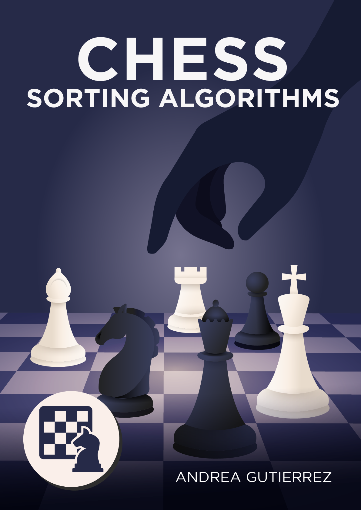

# Algoritmos de Ordenamiento para Ajedrez

## Características

Simulación interactiva en CLI

- Implementación de 8 algoritmos de ordenamiento
- Modelado POO de piezas de ajedrez
- Generación aleatoria de configuraciones válidas
- Medición de tiempo de ejecución
- Visualización paso a paso con control de velocidad

## Requisitos

- Java JDK 17+
- Maven 3.8+
- Git 2.3+

## Instalación

Clona el repositorio:

```bash
git clone https://github.com/GutBla/PROJECT_Chess_Sorting_Algorithms.git
cd PROJECT_Chess_Sorting_Algorithms
```
## ¿Qué es el Ajedrez?

El ajedrez es un juego de estrategia de mesa que se juega entre dos personas. Se desarrolla en un tablero de 8x8 casillas y cada jugador cuenta con un conjunto de 16 piezas, cada una con movimientos y funciones específicas. El objetivo principal del juego es capturar al rey del oponente mediante una serie de movimientos estratégicos.

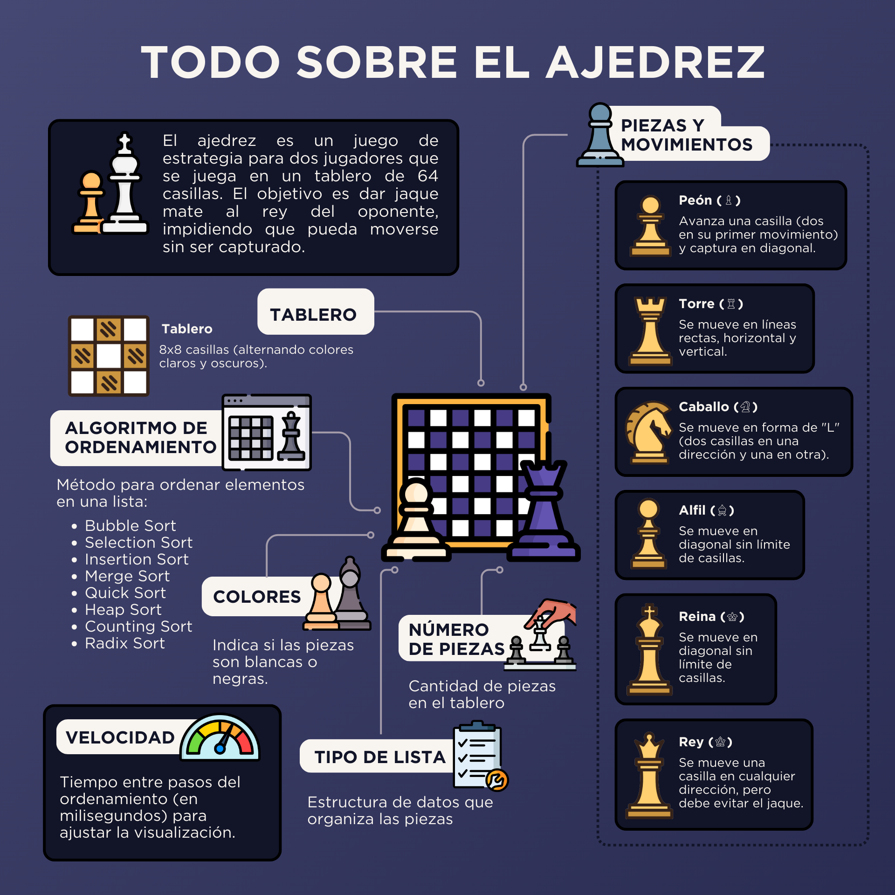

## Historia del Ajedrez

El ajedrez tiene una historia milenaria que se remonta a la India en el siglo VI, donde se jugaba una versión primitiva llamada "Chaturanga". Este juego se extendió a Persia, donde se le llamó "Shatranj" y posteriormente llegó a Europa a través de los árabes. En el siglo XV, el ajedrez moderno tomó forma en España e Italia, con las reglas y movimientos que conocemos hoy en día.


## Piezas del Ajedrez

El juego consta de las siguientes piezas:

| Pieza | Icono | Abreviaciones | Movimiento |
| --- | --- | --- | --- |
| Rey | ♔ / ♚ | KB / KN | Se mueve una casilla en cualquier dirección |
| Reina | ♕ / ♛ | QB / QN | Se mueve en todas las direcciones sin límite de casillas |
| Torre | ♖ / ♜ | TB / TN | Se mueve en líneas rectas |
| Alfil | ♗ / ♝ | AB / AN | Se mueve en diagonales |
| Caballo | ♘ / ♞ | CB / CN | Se mueve en "L" |
| Peón | ♙ / ♟ | PB / PN | Se mueve una casilla hacia adelante, captura en diagonal |

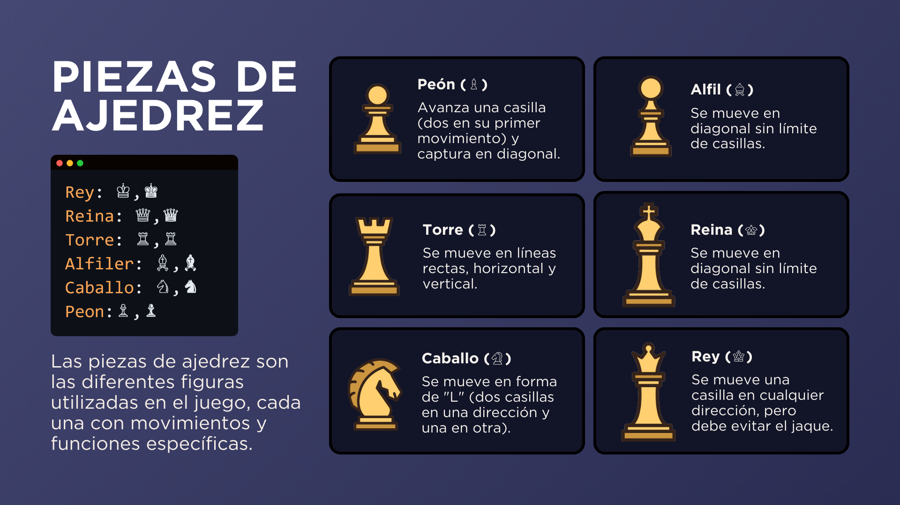

---

## Tablero de Ajedrez

El tablero de ajedrez es una cuadrícula de 8x8 casillas alternadas entre colores claros y oscuros. Cada casilla está identificada por coordenadas alfanuméricas (ejemplo: "e4").

```bash
  +----+----+----+----+----+----+----+----+
8 | TN | CN | AN | QN | KN | AN | CN | TN |
  +----+----+----+----+----+----+----+----+
7 | PN | PN | PN | PN | PN | PN | PN | PN |
  +----+----+----+----+----+----+----+----+
6 |    |    |    |    |    |    |    |    |
  +----+----+----+----+----+----+----+----+
5 |    |    |    |    |    |    |    |    |
  +----+----+----+----+----+----+----+----+
4 |    |    |    |    |    |    |    |    |
  +----+----+----+----+----+----+----+----+
3 |    |    |    |    |    |    |    |    |
  +----+----+----+----+----+----+----+----+
2 | PN | PN | PN | PN | PN | PN | PN | PN |
  +----+----+----+----+----+----+----+----+
1 | TN | CN | AN | QN | KN | AN | CN | TN |
  +----+----+----+----+----+----+----+----+
    A    B    C    D    E    F    G    H

```

```bash
  +----+----+----+----+----+----+----+----+
8 | ♜ | ♞ | ♝ | ♛ | ♚ | ♝ | ♞ | ♜ |
  +----+----+----+----+----+----+----+----+
7 | ♟ | ♟ | ♟ | ♟ | ♟ | ♟ | ♟ | ♟ |
  +----+----+----+----+----+----+----+----+
6 |    |    |    |    |    |    |    |    |
  +----+----+----+----+----+----+----+----+
5 |    |    |    |    |    |    |    |    |
  +----+----+----+----+----+----+----+----+
4 |    |    |    |    |    |    |    |    |
  +----+----+----+----+----+----+----+----+
3 |    |    |    |    |    |    |    |    |
  +----+----+----+----+----+----+----+----+
2 | ♙ | ♙ | ♙ | ♙ | ♙ | ♙ | ♙ | ♙ |
  +----+----+----+----+----+----+----+----+
1 | ♖ | ♘ | ♗ | ♕ | ♔ | ♗ | ♘ | ♖ |
  +----+----+----+----+----+----+----+----+
    A    B    C    D    E    F    G    H

```

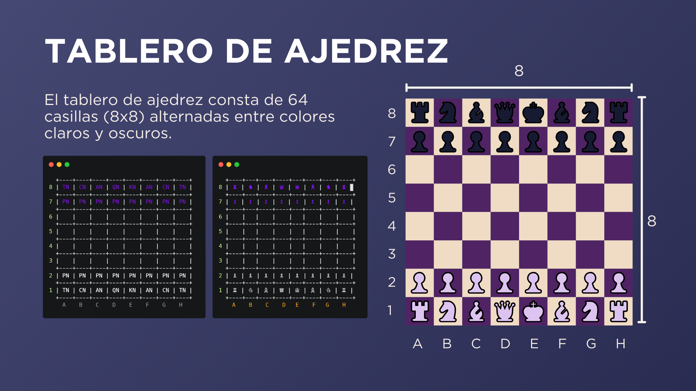

## Algoritmos de Ordenamiento (a)

Los algoritmos de ordenamiento son procedimientos diseñados para organizar un conjunto de elementos en un orden determinado, ya sea ascendente o descendente. Estos algoritmos tienen aplicaciones en informática, bases de datos y en este caso, en la organización de las piezas de ajedrez en un tablero.

> [!WARNING]
> Algoritmos de Ordenamiento (a):
> 
> - **Valores Válidos:** s, b , i, m, q, h, c, r.
> - **Validación:** Si no es uno de los valores validos, se considera **inválido**.


### Selection Sort (Selección) `a=s` o `a=S`

Este algoritmo selecciona el elemento más pequeño y lo intercambia con el primer elemento, repitiendo este proceso con el resto de la lista.

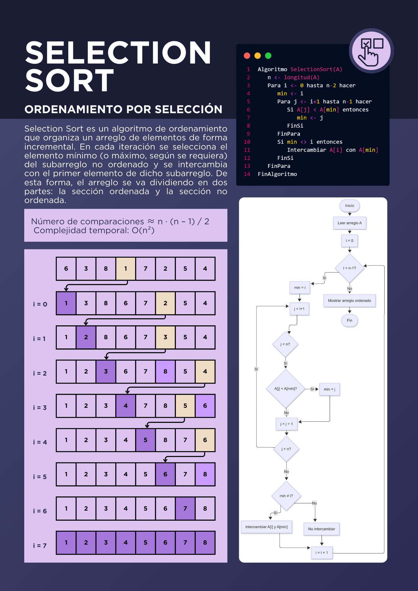

### Bubble Sort (Burbuja) `a=b` o `a=B`

Compara elementos adyacentes y los intercambia si están en el orden incorrecto, recorriendo la lista varias veces.

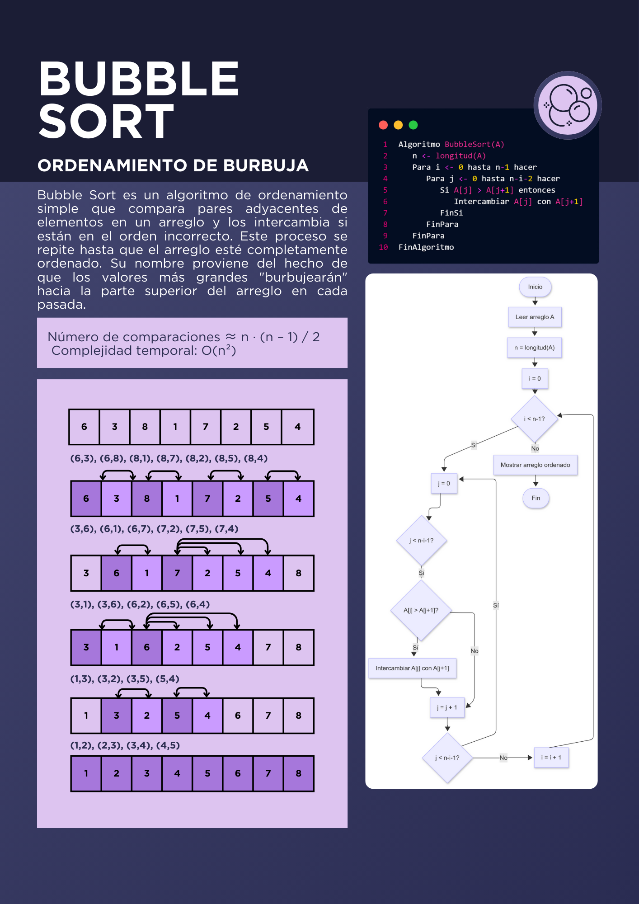

### Insertion Sort (Inserción) `a=i` o `a=I`

Inserta cada elemento en su posición correcta dentro de una parte ordenada de la lista.

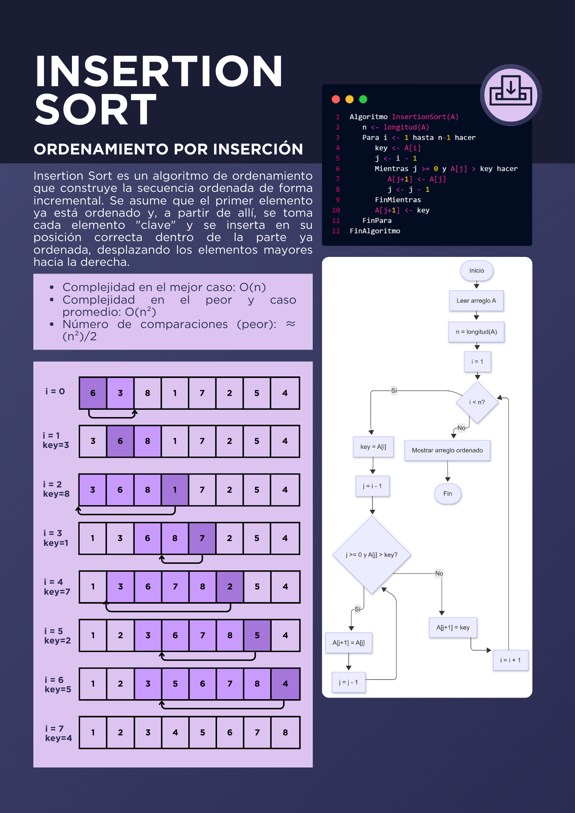

### Merge Sort (Combinación) `a=m` o `a=M`

Divide la lista en partes más pequeñas, las ordena y luego las combina en una lista ordenada.

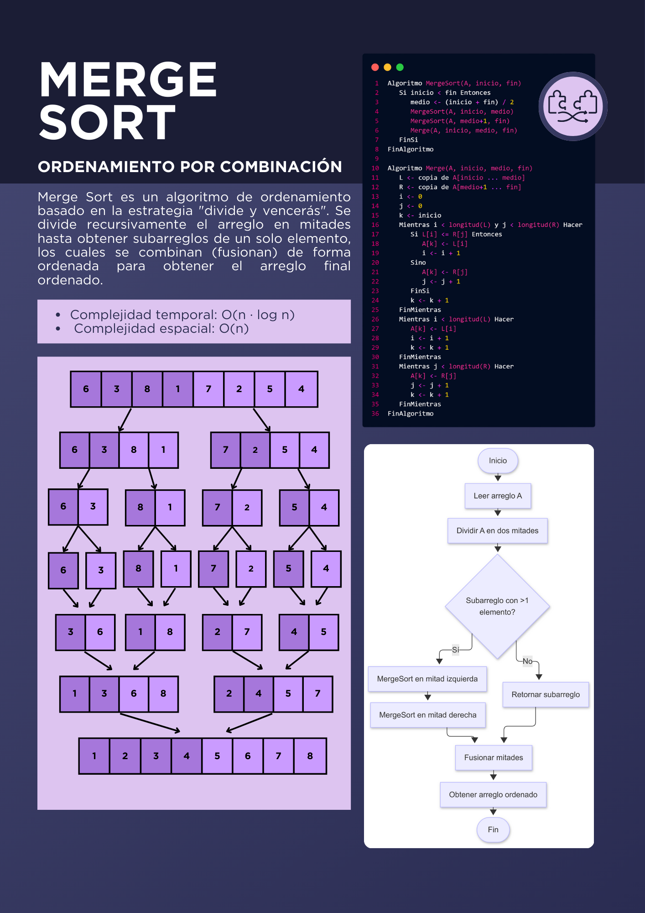

### Quick Sort (Rápida) `a=q` o `a=Q`

Selecciona un pivote, divide la lista en elementos menores y mayores que el pivote y ordena cada sublista recursivamente.

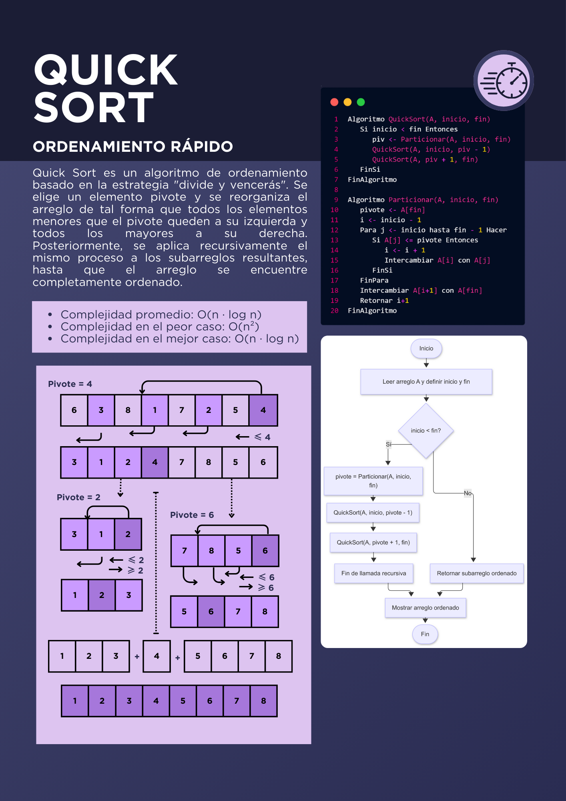

### Heap Sort (Montón) `a=h` o `a=H`

Construye un montón binario y extrae el elemento más grande repetidamente para formar la lista ordenada.

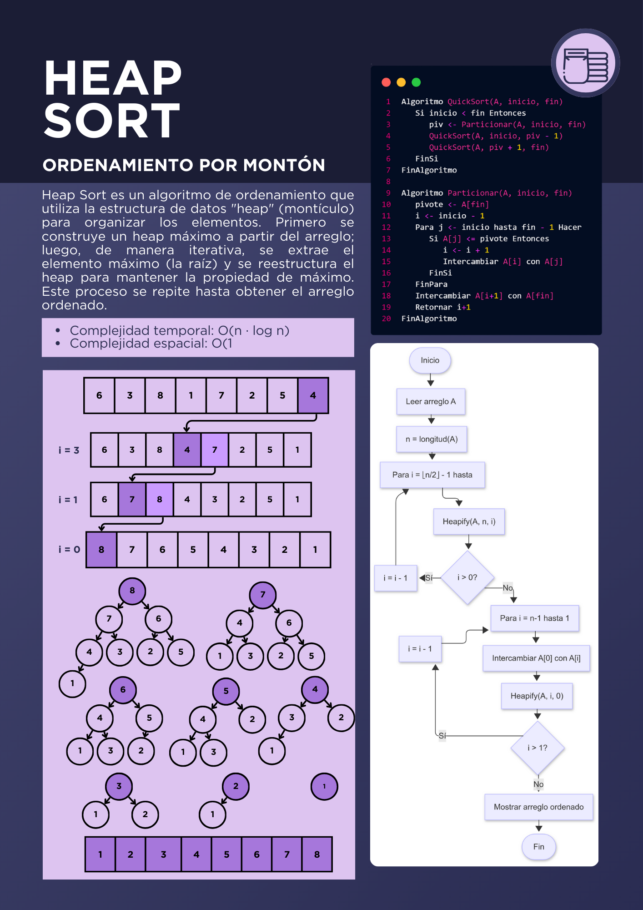

### Counting Sort (Conteo) `a=c` o `a=C`

Cuenta la frecuencia de cada elemento y usa esa información para construir la lista ordenada.

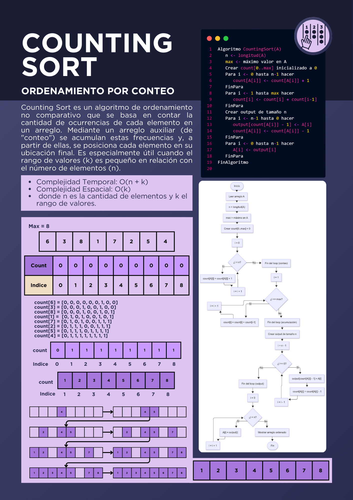

### Radix Sort (Raíz) `a=r` o `a=R`

Ordena los números considerando sus dígitos de menor a mayor peso.

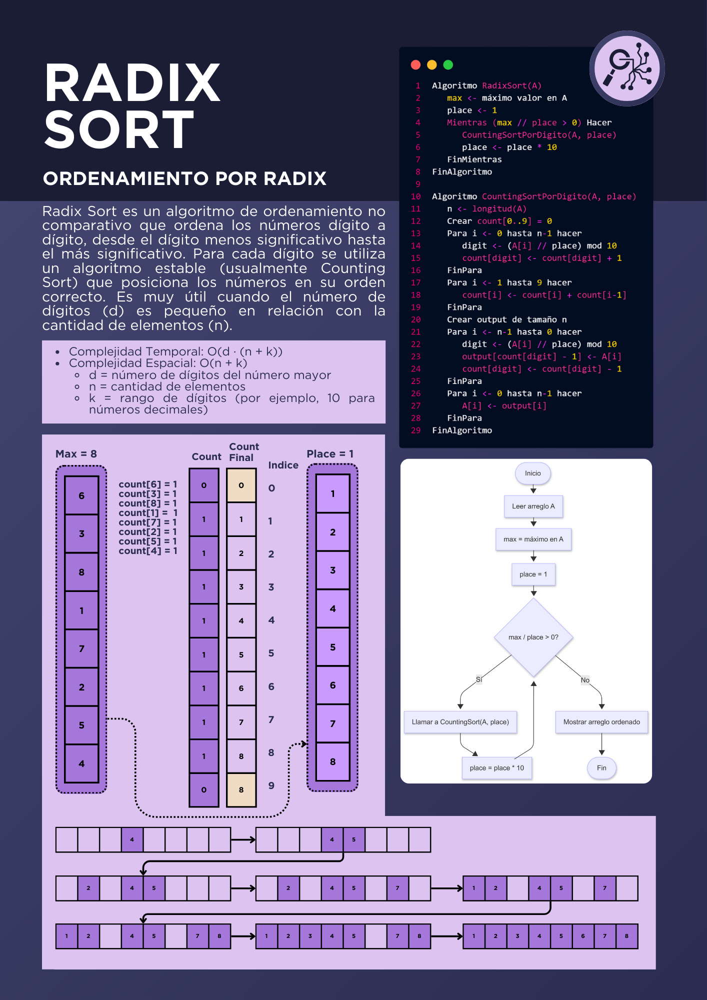

## Tipos de Listas (t)

En el proyecto se pueden representar las piezas del ajedrez usando dos tipos de listas:

> [!WARNING]
> Tipos de Listas (t):
> 
> - **Valores Válidos:** n , c
> - **Validación:** Si no es uno de los valores validos, se considera **inválido**

### Lista de Números `t=n` o `t=N`

```
1. Rey
2. Reina
3. Torre I
4. Torre II
5. Alfil I
6. Alfil II
7. Caballo I
8. Caballo II
9. Peón 1
10. Peón 2
11. Peón 3
12. Peón 4
13. Peón 5
14. Peón 6
15. Peón 7
16. Peón 8
```

### Lista de Caracteres `t=c` o `t=C`

```
a. Rey
b. Reina
c. Torre I
d. Torre II
e. Alfil I
f. Alfil II
g. Caballo I
h. Caballo II
i. Peón 1
j. Peón 2
k. Peón 3
l. Peón 4
m. Peón 5
n. Peón 6
o. Peón 7
p. Peón 8
```

## ¿Qué significa el Color de Piezas (c)?

Las piezas pueden tener dos colores:

> [!WARNING]
> Color de Piezas (c):
> 
> - **Valores Válidos:** b , w
> - **Validación:** Si no es uno de los valores validos, se considera **inválido**

### Piezas Negras

Representan el jugador de las piezas oscuras.  `c=b` o `c=B`

### Piezas Blancas

Representan el jugador de las piezas claras. `c=w` o `c+W`

## ¿Qué es la Cantidad de Piezas (r)?

Determina cuántas piezas se colocan en el tablero:

> [!WARNING]
> Cantidad de Piezas (r):
> 
> - **Valores Válidos:** 1, 2, 3, 4, 6, 8, 10, 16
> - **Validación:** Si no es uno de los valores validos, se considera **inválido**


| Valor | Piezas Incluidas |
| --- | --- |
| 1 | Rey |
| 2 | Rey y Reina |
| 4 | Alfiles, Rey y Reina |
| 6 | Caballos, Alfiles, Rey y Reina |
| 8 | Torres, Caballos, Alfiles, Rey y Reina |
| 10 | Peones |
| 16 | Todas las piezas |

## ¿Qué es la Velocidad (s)?

La velocidad `s` representa la pausa en milisegundos entre cada paso de ejecución de los algoritmos, variando entre 100 y 1000 ms.

> [!WARNING]
> Cantidad de Piezas (r):
> 
> - **Valores Válidos (Rango):** (100 - 1000)
> - **Validación:** Si no es uno de los valores validos dentro del rango, se considera **inválido**


## Simulación y Resultados

Este documento proporciona una base académica y estructurada para el desarrollo del proyecto Capstone Chess, asegurando una explicación detallada y ordenada de los elementos involucrados.

### Parámetros de Ejecución

| Parámetro | Valores                                | Descripción                           |
|-----------|----------------------------------------|---------------------------------------|
| `a`       | `B`, `S`, `I`, `M`, `Q`, `H`, `C`, `R` | Algoritmo de ordenamiento             |
| `t`       | `N`, `C`                               | Tipo de lista (numérica o caracteres) |
| `o`       | `B`, `W`                               | Color de piezas (negras o blancas)    |
| `r`       | `1`, `2`, `4`, `6`, `8`, `10`, `16`    | Número de piezas a ordenar            |
| `s`       | `100` a `1000`                         | Velocidad de visualización (ms)       |

**Configuración de Simulación:**

Input (CLI):

```bash
a=b t=n c=w r=16 s=200
```

Output:

```bash
Algoritmo: [BubbleSort]
Tipo de lista: [Lista numérica]
Color de piezas: [Blancas]
Número de piezas: [16]
Velocidad: [200] ms
```

```bash
  +----+----+----+----+----+----+----+----+
8 | ♜ |    |    | ♝ |    | ♟ |    |    |
  +----+----+----+----+----+----+----+----+
7 |    | ♞ |    |    | ♟ |    |    |    |
  +----+----+----+----+----+----+----+----+
6 |    |    |    |    |    |    | ♟ |    |
  +----+----+----+----+----+----+----+----+
5 | ♟ |    | ♟ |    | ♛ |    |    |    |
  +----+----+----+----+----+----+----+----+
4 | ♟ | ♜ |    |    |    |    | ♟ |    |
  +----+----+----+----+----+----+----+----+
3 |    | ♚ |    | ♟ |    |    |    |    |
  +----+----+----+----+----+----+----+----+
2 |    |    |    |    |    | ♞ |    |    |
  +----+----+----+----+----+----+----+----+
1 |    |    | ♝ |    |    |    |    |    |
  +----+----+----+----+----+----+----+----+
    A    B    C    D    E    F    G    H

```

```bash
  +----+----+----+----+----+----+----+----+
8 | ♜ | ♝ | ♟ | ♞ | ♟ | ♟ | ♟ | ♟ |
  +----+----+----+----+----+----+----+----+
7 | ♟ | ♛ | ♟ | ♜ | ♚ | ♟ | ♞ | ♝ | 
  +----+----+----+----+----+----+----+----+
6 |    |    |    |    |    |    |    |    |
  +----+----+----+----+----+----+----+----+
5 |    |    |    |    |    |    |    |    |
  +----+----+----+----+----+----+----+----+
4 |    |    |    |    |    |    |    |    |
  +----+----+----+----+----+----+----+----+
3 |    |    |    |    |    |    |    |    |
  +----+----+----+----+----+----+----+----+
2 |    |    |    |    |    |    |    |    |
  +----+----+----+----+----+----+----+----+
1 |    |    |    |    |    |    |    |    |
  +----+----+----+----+----+----+----+----+
    A    B    C    D    E    F    G    H
```

…

```bash

Tiempo total: [4249] ms
  +----+----+----+----+----+----+----+----+
8 | ♜ | ♞ | ♝ | ♛ | ♚ | ♝ | ♞ | ♜ |
  +----+----+----+----+----+----+----+----+
7 | ♟ | ♟ | ♟ | ♟ | ♟ | ♟ | ♟ | ♟ |
  +----+----+----+----+----+----+----+----+
6 |    |    |    |    |    |    |    |    |
  +----+----+----+----+----+----+----+----+
5 |    |    |    |    |    |    |    |    |
  +----+----+----+----+----+----+----+----+
4 |    |    |    |    |    |    |    |    |
  +----+----+----+----+----+----+----+----+
3 |    |    |    |    |    |    |    |    |
  +----+----+----+----+----+----+----+----+
2 |    |    |    |    |    |    |    |    |
  +----+----+----+----+----+----+----+----+
1 |    |    |    |    |    |    |    |    |
  +----+----+----+----+----+----+----+----+
    A    B    C    D    E    F    G    H
```

## Workflow (Flujo de trabajo)

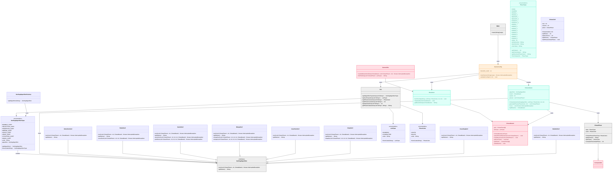

```bash
---
config:
  theme: base
---
classDiagram
    class Main {
        +main(args: String[]) : void
    }

    class GameConfig {
        +startGame(args: String[]) : void
        -parseArguments(args: String[]) : void
        -validateParameters() : void
    }

    class SortingAlgorithm {
        <<interface>>
        +sort(list: List<int>) : List<int>
    }

    class BubbleSort {
        +sort(list: List<int>) : List<int>
    }

    class CountingSort {
        +sort(list: List<int>) : List<int>
    }

    class HeapSort {
        +sort(list: List<int>) : List<int>
    }

    class InsertionSort {
        +sort(list: List<int>) : List<int>
    }

    class MergeSort {
        +sort(list: List<int>) : List<int>
    }

    class QuickSort {
        +sort(list: List<int>) : List<int>
    }

    class RadixSort {
        +sort(list: List<int>) : List<int>
    }

    class SelectionSort {
        +sort(list: List<int>) : List<int>
    }

    class SortingAlgorithmFactory {
        +createAlgorithm(type: SortingAlgorithmType) : SortingAlgorithm
    }

    class ChessBoard {
        +getGrid() : ChessCell[][]
        +updateLayout(pieces: List<ChessPiece>) : void
        -grid: ChessCell[][]
    }

    class ChessCell {
        +getPiece() : ChessPiece
        -piece: ChessPiece
    }

    class ChessPiece {
        +getSymbol() : String
        +getDisplayValue(isNumeric: Boolean) : String
        -symbol: String
        -color: PieceColor
        -position: ChessCell
    }

    class Bishop {
        +getSymbol() : String
        +getDisplayValue(isNumeric: Boolean) : String
    }

    class King {
        +getSymbol() : String
        +getDisplayValue(isNumeric: Boolean) : String
    }

    class Knight {
        +getSymbol() : String
        +getDisplayValue(isNumeric: Boolean) : String
    }

    class Pawn {
        +getSymbol() : String
        +getDisplayValue(isNumeric: Boolean) : String
    }

    class Queen {
        +getSymbol() : String
        +getDisplayValue(isNumeric: Boolean) : String
    }

    class Rook {
        +getSymbol() : String
        +getDisplayValue(isNumeric: Boolean) : String
    }

    class ChessGame {
        +start() : void
        +movePiece(from: ChessCell, to: ChessCell) : void
        -currentPlayer: PieceColor
        -board: ChessBoard
    }

    class Renderer {
        +printConfig(algorithm: String, listType: ListType, color: PieceColor, pieces: int, speed: int) : void
        +printTitle() : void
        +displayBoard(board: ChessBoard) : void
        -formatWithColor(text: String, color: String) : String
    }

    class GameUtils {
        +updateBoardAndPause(board: ChessBoard, chessPieces: List<ChessPiece>, pauseDuration: int) : void
        +swapChessPieces(chessPieces: List<ChessPiece>, indexA: int, indexB: int) : void
        +chessPiecesToString(chessPieces: List<ChessPiece>, listType: ListType) : String
        -formatList(chessPieces: List<ChessPiece>, listType: ListType) : String
    }

    class ConsoleColor {
        +MORADO : String
        +VERDE : String
        +AMARILLO : String
        +AZUL : String
        +ROJO : String
        +NARANJA : String
        +BLACK : String
        +WHITE : String
        +CYAN : String
        +RESET : String
    }

    class MetricsManager {
        +getInstance() : MetricsManager
        +getStepCounter() : StepCounter
        +getTimeCounter() : TimeCounter
        -stepCounter: StepCounter
        -timeCounter: TimeCounter
    }

    class StepCounter {
        +increment() : void
        -count: int
    }

    class TimeCounter {
        +start() : void
        +stop() : void
        +getTotalTime() : String
        -startTime: long
        -endTime: long
    }

    class InvalidParameterException {
        +InvalidParameterException(message: String) : void
        -message: String
    }

    class MissingParameterException {
        +MissingParameterException(message: String) : void
        -message: String
    }

    class ListType {
        <<enumeration>>
        +NUMERIC
        +CHARACTER
    }

    class PieceColor {
        <<enumeration>>
        +WHITE
        +BLACK
    }

    class SortingAlgorithmType {
        <<enumeration>>
        +BUBBLE
        +INSERTION
        +MERGE
        +QUICK
        +RADIX
        +SELECTION
        +HEAP
        +COUNTING
    }

    Main --> GameConfig
    GameConfig --> SortingAlgorithmFactory
    SortingAlgorithmFactory --> SortingAlgorithm
    SortingAlgorithm <|.. BubbleSort
    SortingAlgorithm <|.. CountingSort
    SortingAlgorithm <|.. HeapSort
    SortingAlgorithm <|.. InsertionSort
    SortingAlgorithm <|.. MergeSort
    SortingAlgorithm <|.. QuickSort
    SortingAlgorithm <|.. RadixSort
    SortingAlgorithm <|.. SelectionSort
    ChessBoard --> ChessCell
    ChessCell --> ChessPiece
    ChessPiece <|-- Bishop
    ChessPiece <|-- King
    ChessPiece <|-- Knight
    ChessPiece <|-- Pawn
    ChessPiece <|-- Queen
    ChessPiece <|-- Rook
    ChessBoard --> ChessGame
    Renderer --> ChessBoard
    GameUtils --> ChessBoard
    GameUtils --> ChessPiece
    GameUtils --> Renderer
    MetricsManager --> StepCounter
    MetricsManager --> TimeCounter
    InvalidParameterException --> GameUtils
    MissingParameterException --> GameUtils
    ConsoleColor --> Renderer

```

# Diagrama de Clases UML

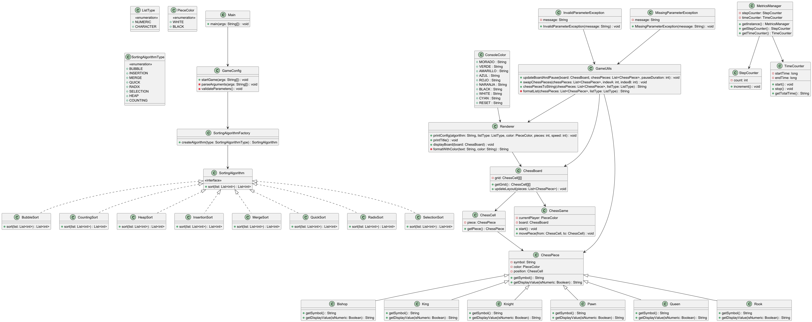

```
@startuml
class Main {
    +main(args: String[]) : void
}

class GameConfig {
    +startGame(args: String[]) : void
    -parseArguments(args: String[]) : void
    -validateParameters() : void
}

class SortingAlgorithm {
    <<interface>>
    +sort(list: List<int>) : List<int>
}

class BubbleSort {
    +sort(list: List<int>) : List<int>
}

class CountingSort {
    +sort(list: List<int>) : List<int>
}

class HeapSort {
    +sort(list: List<int>) : List<int>
}

class InsertionSort {
    +sort(list: List<int>) : List<int>
}

class MergeSort {
    +sort(list: List<int>) : List<int>
}

class QuickSort {
    +sort(list: List<int>) : List<int>
}

class RadixSort {
    +sort(list: List<int>) : List<int>
}

class SelectionSort {
    +sort(list: List<int>) : List<int>
}

class SortingAlgorithmFactory {
    +createAlgorithm(type: SortingAlgorithmType) : SortingAlgorithm
}

class ChessBoard {
    +getGrid() : ChessCell[][]
    +updateLayout(pieces: List<ChessPiece>) : void
    -grid: ChessCell[][]
}

class ChessCell {
    +getPiece() : ChessPiece
    -piece: ChessPiece
}

class ChessPiece {
    +getSymbol() : String
    +getDisplayValue(isNumeric: Boolean) : String
    -symbol: String
    -color: PieceColor
    -position: ChessCell
}

class Bishop {
    +getSymbol() : String
    +getDisplayValue(isNumeric: Boolean) : String
}

class King {
    +getSymbol() : String
    +getDisplayValue(isNumeric: Boolean) : String
}

class Knight {
    +getSymbol() : String
    +getDisplayValue(isNumeric: Boolean) : String
}

class Pawn {
    +getSymbol() : String
    +getDisplayValue(isNumeric: Boolean) : String
}

class Queen {
    +getSymbol() : String
    +getDisplayValue(isNumeric: Boolean) : String
}

class Rook {
    +getSymbol() : String
    +getDisplayValue(isNumeric: Boolean) : String
}

class ChessGame {
    +start() : void
    +movePiece(from: ChessCell, to: ChessCell) : void
    -currentPlayer: PieceColor
    -board: ChessBoard
}

class Renderer {
    +printConfig(algorithm: String, listType: ListType, color: PieceColor, pieces: int, speed: int) : void
    +printTitle() : void
    +displayBoard(board: ChessBoard) : void
    -formatWithColor(text: String, color: String) : String
}

class GameUtils {
    +updateBoardAndPause(board: ChessBoard, chessPieces: List<ChessPiece>, pauseDuration: int) : void
    +swapChessPieces(chessPieces: List<ChessPiece>, indexA: int, indexB: int) : void
    +chessPiecesToString(chessPieces: List<ChessPiece>, listType: ListType) : String
    -formatList(chessPieces: List<ChessPiece>, listType: ListType) : String
}

class ConsoleColor {
    +MORADO : String
    +VERDE : String
    +AMARILLO : String
    +AZUL : String
    +ROJO : String
    +NARANJA : String
    +BLACK : String
    +WHITE : String
    +CYAN : String
    +RESET : String
}

class MetricsManager {
    +getInstance() : MetricsManager
    +getStepCounter() : StepCounter
    +getTimeCounter() : TimeCounter
    -stepCounter: StepCounter
    -timeCounter: TimeCounter
}

class StepCounter {
    +increment() : void
    -count: int
}

class TimeCounter {
    +start() : void
    +stop() : void
    +getTotalTime() : String
    -startTime: long
    -endTime: long
}

class InvalidParameterException {
    +InvalidParameterException(message: String) : void
    -message: String
}

class MissingParameterException {
    +MissingParameterException(message: String) : void
    -message: String
}

class ListType {
    <<enumeration>>
    +NUMERIC
    +CHARACTER
}

class PieceColor {
    <<enumeration>>
    +WHITE
    +BLACK
}

class SortingAlgorithmType {
    <<enumeration>>
    +BUBBLE
    +INSERTION
    +MERGE
    +QUICK
    +RADIX
    +SELECTION
    +HEAP
    +COUNTING
}

Main --> GameConfig
GameConfig --> SortingAlgorithmFactory
SortingAlgorithmFactory --> SortingAlgorithm
SortingAlgorithm <|.. BubbleSort
SortingAlgorithm <|.. CountingSort
SortingAlgorithm <|.. HeapSort
SortingAlgorithm <|.. InsertionSort
SortingAlgorithm <|.. MergeSort
SortingAlgorithm <|.. QuickSort
SortingAlgorithm <|.. RadixSort
SortingAlgorithm <|.. SelectionSort
ChessBoard --> ChessCell
ChessCell --> ChessPiece
ChessPiece <|-- Bishop
ChessPiece <|-- King
ChessPiece <|-- Knight
ChessPiece <|-- Pawn
ChessPiece <|-- Queen
ChessPiece <|-- Rook
ChessBoard --> ChessGame
Renderer --> ChessBoard
GameUtils --> ChessBoard
GameUtils --> ChessPiece
GameUtils --> Renderer
MetricsManager --> StepCounter
MetricsManager --> TimeCounter
InvalidParameterException --> GameUtils
MissingParameterException --> GameUtils
ConsoleColor --> Renderer
@enduml

```

## Execution (Ejecución)

Input (CLI):

```bash
a=b t=n c=w r=16 s=200
```

Output:

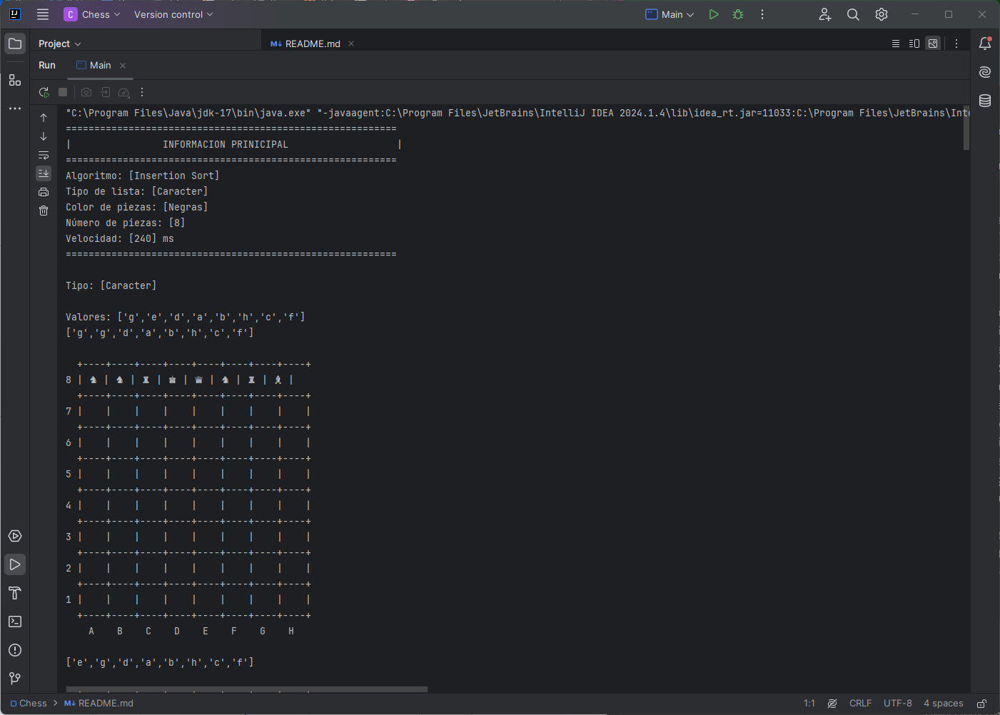

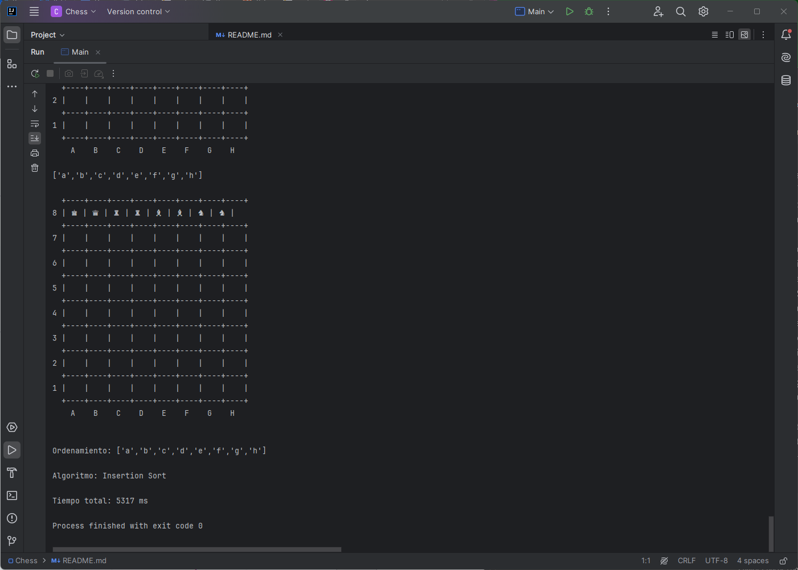

Input (CLI):

```bash

```

Output:
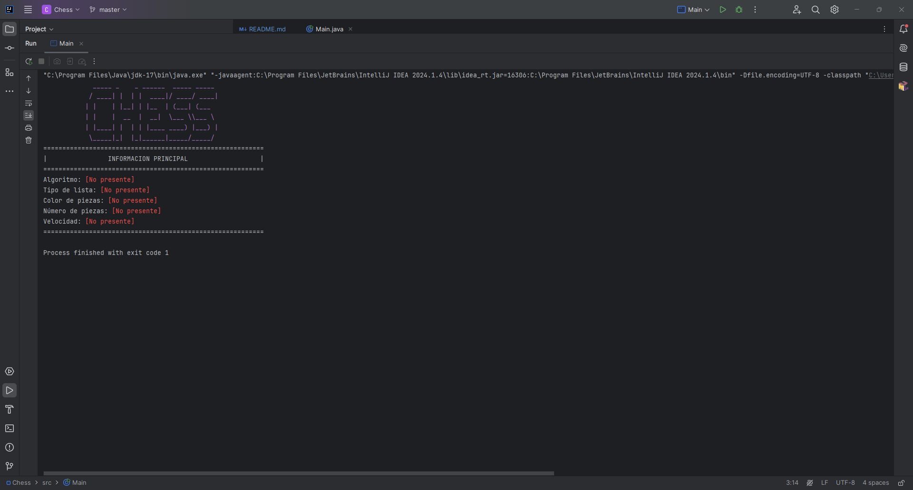

Input (CLI):

```bash
 a=x t=x c=x r=7 s=1
```

Output:
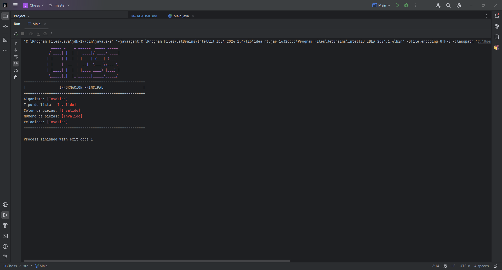